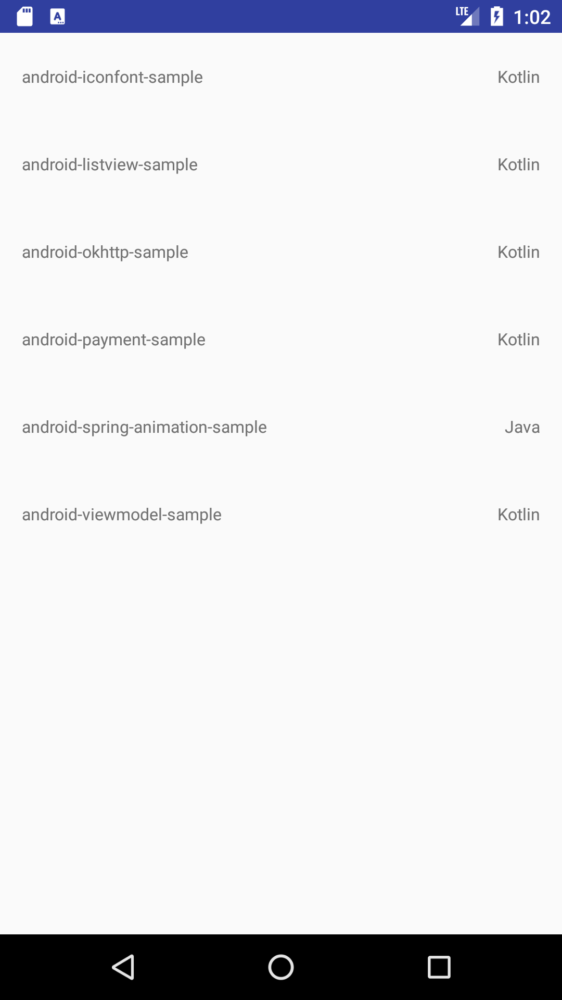

# android-viewmodel-sample

## overview
It's a sample project for ViewModel in Architecture Components.



## use arch package alpha3
```
// arch
compile "android.arch.lifecycle:runtime:1.0.0-alpha3"
compile "android.arch.lifecycle:extensions:1.0.0-alpha3"
annotationProcessor "android.arch.lifecycle:compiler:1.0.0-alpha3"
```

## OSS
```
// retrofit
compile 'com.squareup.retrofit2:retrofit:2.3.0'
compile 'com.squareup.retrofit2:converter-gson:2.3.0'
```
